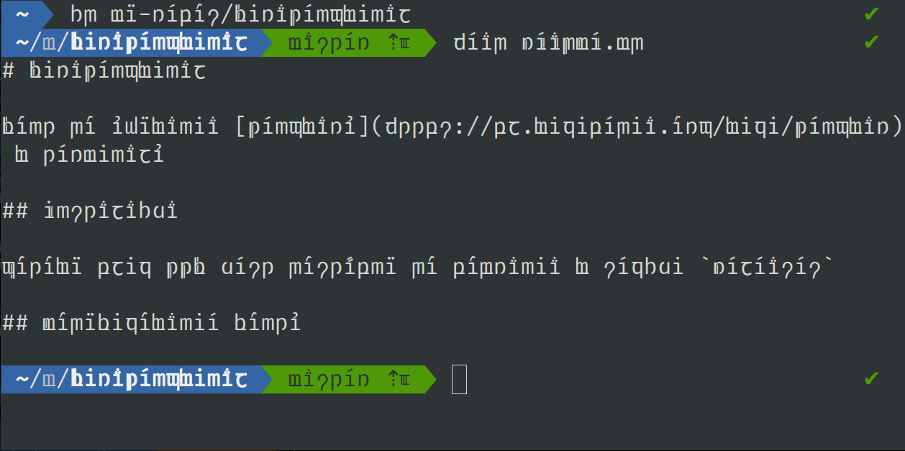

# FiraTengwinal

Font do używania [Tengwaru](https://pl.wikipedia.org/wiki/Tengwar) w terminalu

To zmodyfikowana wersja Fira Code w której podmieniono wszystkie litery w alfabecie polskim i łacińskim, oraz cyfry na zapis tengwarem.

## Instalacja

Gotowy plik TTF jest dostępny do pobrania w sekcji `Releases`

## Zmiany względem 

## Modyfikowanie fontu

- Projekt znaków jest w pliku `glify.svg`
- Zalecany Linux (problemy z Inkscape w wierszu poleceń windows)
- Wymagania
  - Python 3
  - Inkscape 1.2+ (wiele stron)
  - FontForge 2020-03-14+ (skrypty Python)
- Skopiuj `glify.svg` do `/tmp`
- Otwórz [Fira Code](https://github.com/tonsky/FiraCode) lub [jej wersję z dodatkowymi ikonami](https://www.nerdfonts.com/font-downloads) w FontForge
- Kliknij `Plik` -> `Wykonaj skrypt`, lub Ctrl+.
- Wklej zawartość `ff_replace.py` do pola tekstowego i kliknij `OK`
- Poczekaj aż wszystkie litery zostaną podmienione

## Dobór znaków

- Głównie oparte o [zapis Michała Świątkiewicza](http://www.mimas.ceti.pl/tengwar/jezyk-polski.php)
- Zmiękczenie spółgłosek są zapisywane pojedynczą kropką, a unosowienia podwójną tehtą.
- Wymóg zachowania każdej litery w oryginalnej kolumnie powoduje że tehtary nie są ligaturami i muszą zawsze stać nad własnym nośnikiem
- Z tego samego powodu jest transliteracja ortograficzna, czyli `rz` jest zapisane dwoma znakami, zamiast tak samo jak `ż`, podobnie `ch` i `h`
- Podobnie homofony muszą mieć różne znaki
  - `u` i `ó`: u z kreską historycznie było innym, dłuższym dźwiękiem, więc tu na długim nośniku
  - `w` i `v`: z tabeli dla polskiego wybrana jedna z nieużywanych tengw która ma podwójny łuk: unque; taka jak wu tylko obrócona
- `q` zapisane jako `ku` przez dostawienie tehta dla `u` ponad tengwą quesse
- `x` jako złożone z dwóch spółgłosek nie mogło być zapisane w naturalny sposób, wybrana nieużywana w polskim tengwa vilya, która przynajmniej jest w grupie `k` i ma pojedynczy łuk dla nieudźwięcznionego dźwięku
- Cyfry wyświetlane w systemie dziesiętnym przez proste podstawienie
- Akcentowane litery niewystępujące w polskim wyświetlane w normalnym alfabecie
- Majuskuły wyróżnione przez podwojenie rdzenia, lub dodanie pionowej linii wewnątrz dla nieregularnych znaków

## Źródła

- [Tengwar dla języka polskiego](http://www.mimas.ceti.pl/tengwar/index.php)
- [Free Tengwar Font Project](https://freetengwar.sourceforge.net/mapping.html), gotowy font i kodowanie użyte przy projektowaniu
- [Fira Mono](https://github.com/mozilla/Fira), oryginalny projekt użytego fontu
- [Fira Code](https://github.com/tonsky/FiraCode), ligatury dla programowania
